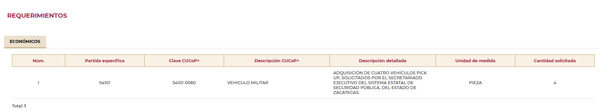
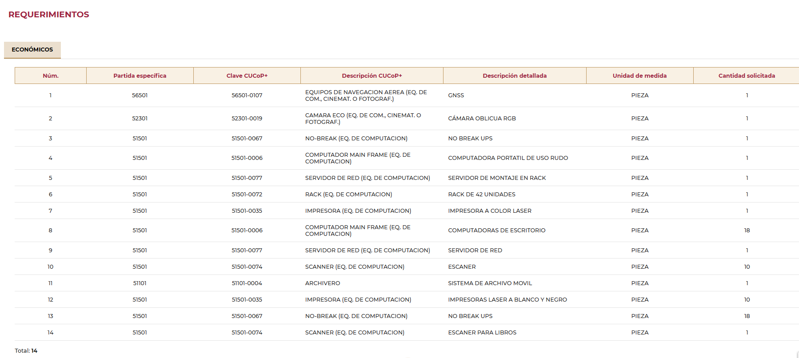

# Web-Scraping Exercise for Mexican States Databases

## Project Overview

This is a web-scraping exercise for a project that involves filling three columns from various databases of many Mexican states. The exercise found in this repository focuses on the state of Zacatecas and serves as an example of automatic scraping for pages made with JavaScript.

---

## Repository Relevant Contents

- **`WebScrapingZacatecas.ipynb`**: The main Python script that performs the web scraping.
- **`ESTADOS.xlsx`**: The processed dataset.
- **`README.md`**: This file, providing an overview and instructions.
---

## Database Structure

The database contains many columns, from which we only cared about the last four. One column had, for every entry, different links for different pages with the same structure. The other columns were empty, and were supposed to be filled with the information from each respective link. The relevant columns were:

1. **`Dirección del anuncio`**: Contains links to web pages with the required information.
2. **`Descripción CUCoP+`**: Product description.
3. **`Canidad `**: Quantity of the product bought.
4. **`Unidad de medida`**: Unit of Measure.
---

## Web Page

**CompraNet**: 

This is an example from the first link in the column:
    
    https://upcp-compranet.hacienda.gob.mx/sitiopublico/#/sitiopublico/detalle/0f6117fcc2bd4c15b9ccf4b5c69fef30/procedimiento



At the bottom, we can find a 1-row table. From there, I extracted the information from columns 4, 6, and 7. This process is repeated for each link in the **`ESTADOS.xlsx`** dataset. However, there is a catch: some links contain a table with up to 50 rows that the dataset wasn't aware of.

For example:
    
    https://upcp-compranet.hacienda.gob.mx/sitiopublico/#/sitiopublico/detalle/0f6117fcc2bd4c15b9ccf4b5c69fef30/procedimiento



For these, the algorithm iterates over every row and adds them to the final dataset. If the initial observations were 65, the final results could have a thousand or more, depending on how many rows were contained in the relevant table of each link.

---

## Code Explanation


This part of the script is responsible for setting up the necessary libraries and loading the Excel file:

```python
# 1
import pandas as pd
from selenium import webdriver
from selenium.webdriver.common.by import By
from selenium.webdriver.chrome.service import Service
from webdriver_manager.chrome import ChromeDriverManager
from selenium.webdriver.support.ui import WebDriverWait
from selenium.webdriver.support import expected_conditions as EC

# 2
excel_path = 'C:/Users/Acer/Downloads/ESTADOS.xlsx'
df = pd.read_excel(excel_path, sheet_name='ZACATECAS 2023')

# 3
def setup_driver():
    options = webdriver.ChromeOptions()
    options.add_argument('--headless')
    driver = webdriver.Chrome(service=Service(ChromeDriverManager().install()), options=options)
    return driver
```
1. **Importing Libraries:**

- **pandas**: A powerful library for data manipulation and analysis.
- **selenium**: A tool for automating web browsers. It is used here for web scraping.
- **webdriver_manager.chrome**: A helper to manage ChromeDriver binaries.
- The **By**, **Service**, **WebDriverWait**, and **expected_conditions** classes from **selenium** are used for locating elements, managing the ChromeDriver service, waiting for elements to load, and defining conditions for waiting, respectively.

2. **Loading the Excel Files:**

- The `pd.read_excel()` function loads the Excel file located at the specified path (`excel_path`).
- `sheet_name='ZACATECAS 2023'` specifies the sheet to be read from the Excel file.
- The data from this sheet is stored in a DataFrame called `df`.

3. **Setting Up Selenium WebDriver:**

- The `setup_driver()` function configures Selenium to use a headless Chrome browser. Headless mode means the browser runs without a GUI, which is useful for automated scripts.
- `options.add_argument('--headless')`: Adds the argument to run Chrome in headless mode.
- `webdriver.Chrome(service=Service(ChromeDriverManager().install()), options=options)`: Initializes the Chrome WebDriver using the ChromeDriverManager to handle driver installation automatically.
- The function returns the configured WebDriver instance, `driver`.


The next part of the code is responsible for iterating through URLs, extracting data from web pages, and saving the data into an Excel file. 

```python
# 1
data = []

# 2
for index, url in enumerate(df['Dirección del anuncio'], start=1):
    driver = setup_driver()
    driver.get(url)
    driver.implicitly_wait(30)  # Esperar a que la página cargue completamente
    print(f"Procesando URL {index} de {len(df)}: {url}")

    # 3
    base_selector = "#p-tabpanel-5 > div > app-sitiopublico-detalle-economicos-pc > div > div > app-sitiopublico-detalle-economicos-list > div.p-col-12.p-sm-12.p-md-12.p-lg-12.ng-star-inserted > p-table > div > div > div > div.p-datatable-scrollable-body.ng-star-inserted > table > tbody > tr"
    rows = driver.find_elements(By.CSS_SELECTOR, base_selector)
    if not rows:
        base_selector = "#p-tabpanel-5 > div > app-sitiopublico-detalle-economicos-pc > div > div > app-sitiopublico-detalle-economicos-list > div.p-col-12.p-sm-12.p-md-12.p-lg-12.ng-star-inserted > p-table > div > div > table > tbody > tr"
        rows = driver.find_elements(By.CSS_SELECTOR, base_selector)
    # 4
    for row in rows:
        description = row.find_element(By.CSS_SELECTOR, 'td:nth-child(4)').text
        unit = row.find_element(By.CSS_SELECTOR, 'td:nth-child(6)').text
        try:
            quantity = row.find_element(By.CSS_SELECTOR, 'td:nth-child(7)').text
        except Exception:
            quantity = "N/A"  # Usa "N/A" o cualquier otro valor que represente un dato no disponible
        # 5
        data.append({'Dirección del anuncio': url, 'Descripción CUCoP+': description, 'Cantidad': quantity, 'Unidad de medida': unit})
        print(f"Extraído: Descripción - {description}, Unidad - {unit}, Cantidad - {quantity}")
    # 6
    driver.quit()

# 7
new_df = pd.DataFrame(data)
new_df.to_excel('C:/Users/Acer/Desktop/PythonNotes/Python/DataSetsPython/ZACATECAS_RESULTS.xlsx', index=False)
print("Proceso completado. El archivo Excel ha sido actualizado.")
```
Here's a detailed explanation:

1. **Initialize Data Storage**:
   - `data = []`: An empty list to store the extracted data.

2. **Iterate Over URLs**:
   - `for index, url in enumerate(df['Dirección del anuncio'], start=1)`: Loops through each URL in the 'Dirección del anuncio' column of the DataFrame.
   - `driver = setup_driver()`: Calls the `setup_driver()` function to initialize the web driver.
   - `driver.get(url)`: Opens the web page for the current URL.
   - `driver.implicitly_wait(30)`: Waits up to 30 seconds for the page to load completely.
   - `print(f"Procesando URL {index} de {len(df)}: {url}")`: Prints the progress of URL processing.

3. **Extract Table Data**:
   - `base_selector = "... > table > tbody > tr"`: Defines the CSS selector for locating table rows.
   - `rows = driver.find_elements(By.CSS_SELECTOR, base_selector)`: Finds all rows in the table using the defined CSS selector.
   - If no rows are found, it tries an alternative CSS selector to locate the table rows.

4. **Extract Data from Each Row**:
   - `for row in rows`: Loops through each row in the table.
   - `description = row.find_element(By.CSS_SELECTOR, 'td:nth-child(4)').text`: Extracts text from the 4th column (description).
   - `unit = row.find_element(By.CSS_SELECTOR, 'td:nth-child(6)').text`: Extracts text from the 6th column (unit).
   - `quantity = row.find_element(By.CSS_SELECTOR, 'td:nth-child(7)').text`: Extracts text from the 7th column (quantity). If this fails, it assigns "N/A" as the quantity.

5. **Store Extracted Data**:
   - `data.append({'Dirección del anuncio': url, 'Descripción CUCoP+': description, 'Cantidad': quantity, 'Unidad de medida': unit})`: Appends the extracted data to the list.
   - `print(f"Extraído: Descripción - {description}, Unidad - {unit}, Cantidad - {quantity}")`: Prints the extracted information.

6. **Close the Web Driver**:
   - `driver.quit()`: Closes the web driver after processing each URL.


7. **Save Extracted Data to Excel**:
   - `new_df = pd.DataFrame(data)`: Converts the list of extracted data into a DataFrame.
   - `new_df.to_excel('C:/Users/Acer/Desktop/PythonNotes/Python/DataSetsPython/ZACATECAS_RESULTS.xlsx', index=False)`: Saves the DataFrame to a new Excel file at the specified path.
   - `print("Proceso completado. El archivo Excel ha sido actualizado.")`: Prints a message indicating that the process is complete and the Excel file has been updated.


The code systematically goes through each URL, scrapes the required data from the web pages, and compiles it into a structured Excel file for further analysis.

---

## Output Explanation

The script prints the progress and extracted data from each URL. Here's an example for the first 4:

```plaintext
Procesando URL 1 de 65: https://upcp-compranet.hacienda.gob.mx/sitiopublico/#/sitiopublico/detalle/0f6117fcc2bd4c15b9ccf4b5c69fef30/procedimiento
Extraído: Descripción - VEHICULO MILITAR, Unidad - PIEZA, Cantidad - 4
Procesando URL 2 de 65: https://upcp-compranet.hacienda.gob.mx/sitiopublico/#/sitiopublico/detalle/d96cf28b23064d83baec96e1fbb04908/procedimiento
Extraído: Descripción - SERVICIOS INTEGRALES, Unidad - SERVICIO, Cantidad - 1
Procesando URL 3 de 65: https://upcp-compranet.hacienda.gob.mx/sitiopublico/#/sitiopublico/detalle/c3fda3cbbb7842c5a03566f2d6cd1236/procedimiento
Extraído: Descripción - TALADRO ELECTRICO (MADERA, METAL, PIEDRA Y PLASTICO), Unidad - PIEZA, Cantidad - 4
Extraído: Descripción - TELEFONO CELULAR (EQ. DE COM., CINEMAT. O FOTOGRAF.), Unidad - PIEZA, Cantidad - 6
Extraído: Descripción - RECEPTOR DE INFORMACION DE ALTA PRECISION GNSS Y GPS, Unidad - PIEZA, Cantidad - 10
Extraído: Descripción - UNIDAD DISCO MAGNETICO REMOVIBLE (EQ. DE COMPUTACION), Unidad - PIEZA, Cantidad - 4
Extraído: Descripción - LAMPARA CON LUPA, Unidad - PIEZA, Cantidad - 14
Extraído: Descripción - CAMARA PARA VIDEOGRABADORA (EQ. DE COM., CINEMAT. O FOTOGRAF.), Unidad - PIEZA, Cantidad - 4
Procesando URL 4 de 65: https://upcp-compranet.hacienda.gob.mx/sitiopublico/#/sitiopublico/detalle/6976298087384613a12e7b553b5b9f00/procedimiento
Extraído: Descripción - MOCHILA PARA REPARTO DE CORRESPONDENCIA, Unidad - PIEZA, Cantidad - 2
Extraído: Descripción - REACTIVOS ANALITICOS, Unidad - PIEZA, Cantidad - 4
Extraído: Descripción - REACTIVOS ANALITICOS, Unidad - PIEZA, Cantidad - 5
Extraído: Descripción - REACTIVOS ANALITICOS, Unidad - PIEZA, Cantidad - 4
Extraído: Descripción - REACTIVOS ANALITICOS, Unidad - PIEZA, Cantidad - 3
Extraído: Descripción - CAMISAS, Unidad - PIEZA, Cantidad - 38
Extraído: Descripción - CAMISAS, Unidad - PIEZA, Cantidad - 48
Extraído: Descripción - PLAYERA, Unidad - PIEZA, Cantidad - 45
Extraído: Descripción - CHAQUETA / CHAMARRA (ATAVIÓ CIVIL MILITAR O RELIGIOSO), Unidad - PIEZA, Cantidad - 35
```

- **Processing Progress**: The script prints the current URL being processed and its index out of the total number of URLs.
  - Example: `Procesando URL 1 de 65: ...`

- **Extracted Data**: For each item found on the page, the script prints the extracted description, unit, and quantity.
  - Example: `Extraído: Descripción - VEHICULO MILITAR, Unidad - PIEZA, Cantidad - 4`

- **Handling Multiple Rows**: Some URLs may contain multiple items, and the script handles each row individually, printing the extracted details for each item.
  - Example for multiple items:
    ```plaintext
    Extraído: Descripción - TALADRO ELECTRICO (MADERA, METAL, PIEDRA Y PLASTICO), Unidad - PIEZA, Cantidad - 4
    Extraído: Descripción - TELEFONO CELULAR (EQ. DE COM., CINEMAT. O FOTOGRAF.), Unidad - PIEZA, Cantidad - 6
    Extraído: Descripción - RECEPTOR DE INFORMACION DE ALTA PRECISION GNSS Y GPS, Unidad - PIEZA, Cantidad - 10
    ```

This output helps in tracking the progress of the script and verifying that data is being extracted correctly from each URL.


---

### Important Note

**ChromeDriver Installation Required**

To run this script, you must have ChromeDriver installed on your computer. ChromeDriver is necessary because it allows Selenium to control the Chrome browser for web scraping tasks. Here’s why it is needed:

- **Browser Automation**: ChromeDriver acts as a bridge between your Selenium scripts and the Chrome browser. It enables the script to open web pages, interact with elements, and extract data.
- **Compatibility**: The version of ChromeDriver must match the version of your Chrome browser. This compatibility is crucial for the script to function correctly.

**Installation Instructions**:

1. **Automatic Installation (Recommended)**:
   - The script uses `webdriver_manager` to automatically manage ChromeDriver. This approach simplifies the setup by downloading the correct version of ChromeDriver based on your installed Chrome browser version.

2. **Manual Installation**:
   - Download ChromeDriver from the [official site](https://getwebdriver.com/).
   - Ensure that the ChromeDriver executable is in your system's PATH.
   - Make sure the version of ChromeDriver matches the version of your installed Chrome browser. You can check your Chrome version by going to `chrome://settings/help` in your browser.

By ensuring ChromeDriver is correctly installed and its version matches your Chrome browser version, you will enable the script to run smoothly and perform the web scraping tasks as intended.

---


Happy scraping!
